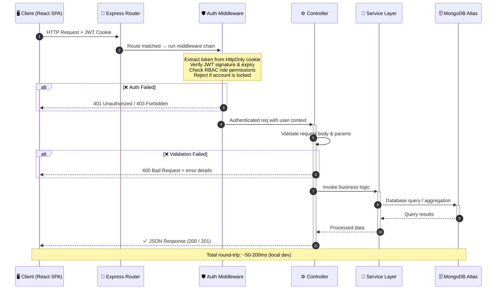
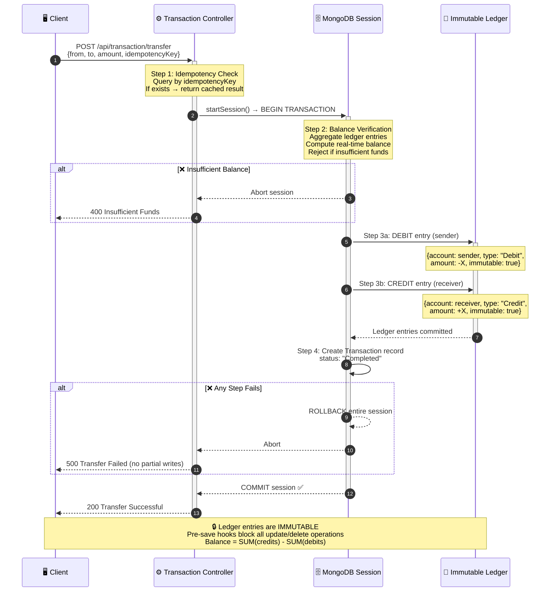
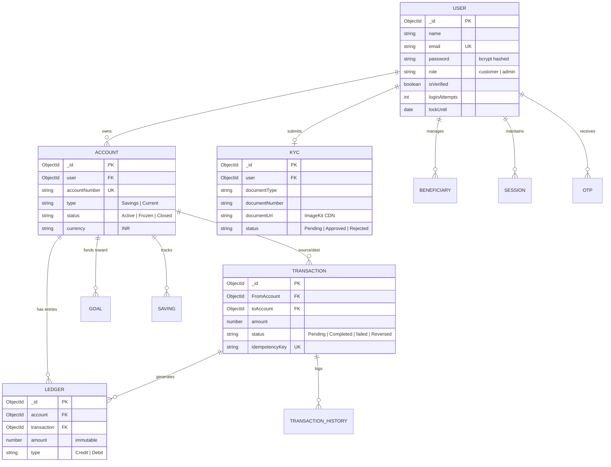
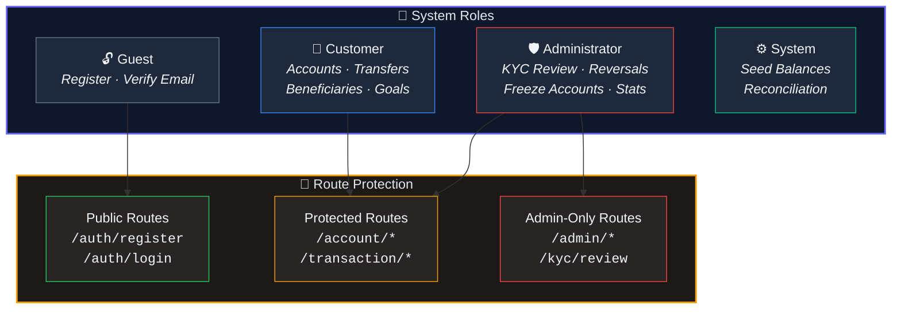

<div align="center">

# 🏦 YONO Bank

### **You Only Need One — Secure Digital Banking Suite**

[](https://nodejs.org/)
[](https://expressjs.com/)
[](https://react.dev/)
[](https://www.mongodb.com/atlas)
[](https://tailwindcss.com/)
[](LICENSE)

<br />

A production-grade, full-stack digital banking application featuring **double-entry ledger bookkeeping**, **ACID-compliant fund transfers**, **idempotent transactions**, **role-based access control (RBAC)**, **automated KYC processing**, and **real-time email notifications** — engineered with enterprise-level security and financial integrity at its core.

<br />

[Getting Started](#-getting-started) · [Architecture](#-architecture) · [API Reference](#-api-reference) · [Security Model](#-security-model) · [Contributing](#-contributing)

---

</div>

<br />

## 📑 Table of Contents

- [Key Features](#-key-features)
- [Architecture](#-architecture)
- [Tech Stack](#-tech-stack)
- [Project Structure](#-project-structure)
- [Getting Started](#-getting-started)
- [Environment Variables](#-environment-variables)
- [API Reference](#-api-reference)
- [Database Schema](#-database-schema)
- [Security Model](#-security-model)
- [Internationalization](#-internationalization)
- [Roadmap](#-roadmap)
- [Contributing](#-contributing)
- [License](#-license)

<br />

## ✨ Key Features

<table>
<tr>
<td width="50%">

### 🔒 Security & Authentication
- **JWT with Silent Rotation** — Short-lived access tokens + HttpOnly refresh cookies
- **Brute-Force Protection** — Auto-locks account after 5 failed login attempts
- **SHA-256 Hashed OTPs** — One-time passwords never stored in plaintext
- **Device Detection Alerts** — Security emails triggered on new device logins
- **Google OAuth 2.0** — Federated sign-in via Passport.js

</td>
<td width="50%">

### 💰 Financial Integrity
- **Double-Entry Ledger** — Immutable credit/debit entries; balances computed via aggregation
- **Idempotent Transactions** — Unique `idempotencyKey` prevents duplicate debits on retry
- **ACID-Compliant Transfers** — MongoDB transaction sessions with full rollback on failure
- **Transaction Reversals** — Admin-controlled reversal workflow with ledger audit trail

</td>
</tr>
<tr>
<td width="50%">

### 📋 KYC & Account Management
- **Digital KYC Submission** — Document upload via ImageKit CDN integration
- **Admin Review Pipeline** — Approve, reject, or request re-submission in real-time
- **Multi-Account Support** — Savings & Current accounts (gated by KYC approval)
- **Account Lifecycle** — Active → Frozen → Closed status management

</td>
<td width="50%">

### 📊 Dashboard & UX
- **Interactive Spending Charts** — Visualize monthly expenditure patterns
- **Savings Goals Tracker** — Set, fund, and track progress toward financial goals
- **Beneficiary Management** — OTP-verified beneficiary registration workflow
- **Multi-Language Support** — English, Spanish, French, German, and Hindi (i18next)

</td>
</tr>
</table>

<br />

## 🏗 Architecture

### System Overview

> The application follows a **layered architecture** pattern with strict separation of concerns. Each layer communicates only with its immediate neighbor, ensuring modularity, testability, and independent scalability.

```mermaid
graph TB
    subgraph CLIENT ["🖥️ &nbsp; Client Layer"]
        direction LR
        SPA["<b>React 19 SPA</b><br/><i>Vite 8 · Tailwind CSS 4 · shadcn/ui</i>"]
        THREE["<b>3D Engine</b><br/><i>Three.js · R3F · GSAP</i>"]
        I18N["<b>i18next</b><br/><i>EN · ES · FR · DE · HI</i>"]
    end

    subgraph GATEWAY ["⚡ &nbsp; API Gateway — Express 5.2"]
        direction LR
        AUTH_R["Auth"]
        ACC_R["Accounts"]
        TXN_R["Transactions"]
        BEN_R["Beneficiary"]
        KYC_R["KYC"]
        ADM_R["Admin"]
        GOAL_R["Goals"]
        DASH_R["Dashboard"]
    end

    subgraph CORE ["🧠 &nbsp; Core Engine"]
        direction LR
        MW["<b>Middleware</b><br/><i>JWT · RBAC · CORS<br/>Cookie Parser · Morgan</i>"]
        CTRL["<b>Controllers</b><br/><i>Request Handlers<br/>Validation · Response</i>"]
        SVC["<b>Services</b><br/><i>Email · Dashboard<br/>OTP · Token Rotation</i>"]
    end

    subgraph DATA ["🗄️ &nbsp; Data & Infrastructure"]
        direction LR
        MONGO[("MongoDB Atlas<br/><i>Mongoose 9 ODM</i>")]
        IMGKIT["ImageKit CDN<br/><i>KYC Documents</i>"]
        GMAIL["Gmail SMTP<br/><i>OAuth2 Emails</i>"]
    end

    CLIENT -- "<i>HTTPS · REST · JSON</i><br/><i>HttpOnly Cookies</i>" --> GATEWAY
    GATEWAY --> CORE
    CORE --> DATA

    style CLIENT fill:#0f172a,stroke:#38bdf8,stroke-width:2px,color:#e2e8f0
    style GATEWAY fill:#1a1a2e,stroke:#6366f1,stroke-width:2px,color:#e2e8f0
    style CORE fill:#14211e,stroke:#10b981,stroke-width:2px,color:#e2e8f0
    style DATA fill:#1c1917,stroke:#f59e0b,stroke-width:2px,color:#e2e8f0

    style SPA fill:#1e293b,stroke:#38bdf8,color:#f1f5f9
    style THREE fill:#1e293b,stroke:#38bdf8,color:#f1f5f9
    style I18N fill:#1e293b,stroke:#38bdf8,color:#f1f5f9

    style AUTH_R fill:#1e1b4b,stroke:#6366f1,color:#f1f5f9
    style ACC_R fill:#1e1b4b,stroke:#6366f1,color:#f1f5f9
    style TXN_R fill:#1e1b4b,stroke:#6366f1,color:#f1f5f9
    style BEN_R fill:#1e1b4b,stroke:#6366f1,color:#f1f5f9
    style KYC_R fill:#1e1b4b,stroke:#6366f1,color:#f1f5f9
    style ADM_R fill:#1e1b4b,stroke:#6366f1,color:#f1f5f9
    style GOAL_R fill:#1e1b4b,stroke:#6366f1,color:#f1f5f9
    style DASH_R fill:#1e1b4b,stroke:#6366f1,color:#f1f5f9

    style MW fill:#064e3b,stroke:#10b981,color:#f1f5f9
    style CTRL fill:#064e3b,stroke:#10b981,color:#f1f5f9
    style SVC fill:#064e3b,stroke:#10b981,color:#f1f5f9

    style MONGO fill:#292524,stroke:#f59e0b,color:#f1f5f9
    style IMGKIT fill:#292524,stroke:#f59e0b,color:#f1f5f9
    style GMAIL fill:#292524,stroke:#f59e0b,color:#f1f5f9
```



<details>
<summary><b>📐 Layered Architecture Summary</b></summary>

<br />

| Layer | Responsibility | Technologies |
|:---|:---|:---|
| **Presentation** | UI rendering, client-side routing, 3D visuals, i18n, form state | React 19, Vite 8, Tailwind CSS 4, shadcn/ui, Three.js, GSAP, Lenis, i18next |
| **API Gateway** | Route registration, URL mapping, HTTP verb handling | Express 5.2 Router (9 route modules) |
| **Middleware** | Cross-cutting concerns: auth, CORS, logging, parsing, errors | JWT, bcryptjs, cookie-parser, morgan, custom RBAC |
| **Controller** | Request validation, orchestrating service calls, response formatting | 9 controller modules |
| **Service** | Business logic, external API integration, email dispatch, aggregation | Nodemailer (OAuth2), Dashboard aggregation, OTP engine |
| **Data Access** | Schema enforcement, immutability hooks, query building, indexing | Mongoose 9 ODM, 12 schema models |
| **Infrastructure** | Cloud database, CDN storage, email delivery | MongoDB Atlas, ImageKit API, Gmail SMTP |

</details>

<br />

### Request Lifecycle

> Every API request passes through a deterministic middleware pipeline before reaching a controller. This diagram traces the complete journey of an authenticated request.



<br />

### Transaction Integrity Pipeline

> Fund transfers are the most critical operation. This diagram shows how the system guarantees **zero data loss** and **zero double-spending** through ACID sessions, idempotency keys, and immutable ledger entries.



<br />

## 🛠 Tech Stack

### Frontend

| Technology | Version | Purpose |
|:---|:---:|:---|
| **React** | `19.2.7` | Component-based UI framework |
| **Vite** | `8.1.0` | Next-generation build tool & dev server |
| **Tailwind CSS** | `4.3.1` | Utility-first CSS framework |
| **shadcn/ui** | `4.12.0` | Accessible component primitives (Radix UI) |
| **Lucide React** | `1.21.0` | Icon system |
| **React Router** | `7.18.0` | Client-side routing (SPA) |
| **Three.js / R3F** | `0.185.0` | 3D graphics & visual effects |
| **GSAP** | `3.15.0` | High-performance animations |
| **Lenis** | `1.3.25` | Smooth scroll engine |
| **i18next** | `26.3.4` | Internationalization framework |
| **Axios** | `1.18.1` | HTTP client for API communication |

### Backend

| Technology | Version | Purpose |
|:---|:---:|:---|
| **Node.js** | `22.x` | JavaScript runtime |
| **Express** | `5.2.1` | Web application framework |
| **Mongoose** | `9.7.0` | MongoDB ODM with schema validation |
| **JSON Web Token** | `9.0.3` | Stateless authentication tokens |
| **bcryptjs** | `3.0.3` | Password hashing (salt rounds) |
| **Nodemailer** | `9.0.1` | Transactional email delivery |
| **Passport.js** | `0.7.0` | Google OAuth 2.0 authentication strategy |
| **Multer** | `2.1.1` | Multipart file upload handling |
| **Morgan** | `1.11.0` | HTTP request logger |
| **cookie-parser** | `1.4.7` | Signed cookie management |

### Infrastructure

| Service | Purpose |
|:---|:---|
| **MongoDB Atlas** | Cloud-hosted database cluster |
| **ImageKit** | CDN-backed image storage for KYC documents |
| **Gmail OAuth2 SMTP** | Transactional email delivery (OTPs, alerts) |

<br />

## 📁 Project Structure

```
Banking_System/
├── Backend/
│   ├── server.js                    # Entry point — bootstraps DB & HTTP listener
│   ├── package.json
│   └── src/
│       ├── app.js                   # Express app configuration & route mounting
│       ├── config/
│       │   ├── config.js            # Environment variable validation & export
│       │   ├── db.js                # MongoDB Atlas connection handler
│       │   └── passport.js          # Google OAuth 2.0 strategy
│       ├── controller/
│       │   ├── auth.controller.js   # Register, login, logout, token refresh
│       │   ├── account.controller.js
│       │   ├── transcation.controller.js  # ACID transfers & idempotency
│       │   ├── beneficiary.controller.js
│       │   ├── Kyc.controller.js
│       │   ├── admin.controller.js  # KYC review, account status, reversals
│       │   ├── goals.controller.js
│       │   ├── dashboard.controller.js
│       │   └── user.controller.js
│       ├── middleware/
│       │   └── auth.middleware.js    # JWT verification & RBAC guard
│       ├── models/
│       │   ├── user.model.js        # User schema (roles, lock timer, verification)
│       │   ├── account.model.js     # Account schema (type, status, currency)
│       │   ├── ledger.model.js      # ⚡ Immutable ledger (pre-save hooks block mutations)
│       │   ├── transaction.model.js # Transaction (idempotencyKey unique index)
│       │   ├── transactionHistory.model.js
│       │   ├── kyc.models.js        # KYC document & status tracking
│       │   ├── beneficiary.model.js
│       │   ├── Goals.model.js
│       │   ├── saving.model.js
│       │   ├── otp.model.js
│       │   ├── session.model.js
│       │   └── blackList.token.model.js
│       ├── routes/                  # RESTful route definitions (9 modules)
│       ├── services/
│       │   ├── email.service.js     # Nodemailer transporter & templates
│       │   └── dashboard.service.js # Aggregation pipelines for statistics
│       └── Utils/
│           ├── otp.utils.js         # SHA-256 OTP generation & hashing
│           └── token.utils.js       # JWT sign / verify helpers
│
├── Frontend/
│   ├── index.html                   # SPA entry point
│   ├── vite.config.js               # Vite + Tailwind CSS + path aliases
│   ├── package.json
│   └── src/
│       ├── App.jsx                  # React Router — route declarations
│       ├── main.jsx                 # React DOM root + i18n initialization
│       ├── index.css                # Global styles & Tailwind directives
│       ├── components/
│       │   ├── LoginPage.jsx        # Multi-step login with brute-force feedback
│       │   ├── RegistrationPage.jsx # Registration with real-time validation
│       │   ├── VerifyUser.jsx       # OTP verification flow
│       │   ├── Footer.jsx
│       │   ├── HeroOrb.jsx          # Three.js 3D animated orb
│       │   ├── app-sidebar.jsx      # Dashboard sidebar navigation
│       │   ├── Dashboard/
│       │   │   ├── Home.jsx
│       │   │   ├── AdminPanel.jsx   # Full admin control center
│       │   │   ├── KYCVerification.jsx
│       │   │   ├── OpenAccount.jsx
│       │   │   ├── beneficiary.jsx
│       │   │   ├── GoalsView.jsx
│       │   │   ├── TransactionHistory.jsx
│       │   │   ├── SpendingChart.jsx
│       │   │   ├── StatsCards.jsx
│       │   │   ├── RecentTransactions.jsx
│       │   │   ├── ProfileView.jsx
│       │   │   ├── ProfileMenu.jsx
│       │   │   ├── SettingsView.jsx
│       │   │   ├── AIInsights.jsx
│       │   │   └── Navbar.jsx
│       │   ├── ui/                  # shadcn/ui primitives (button, input, sidebar…)
│       │   └── tailgrids/           # Tailgrids component extensions
│       ├── hooks/
│       │   └── use-mobile.js        # Responsive breakpoint hook
│       ├── i18n/
│       │   ├── index.js             # i18next configuration
│       │   └── locales/             # 🌐 en · es · fr · de · hi
│       ├── utils/                   # Frontend utility functions
│       └── assets/                  # Static assets (images, SVGs)
│
├── .gitignore
├── Synopsis.md                      # Detailed project synopsis & methodology
└── README.md                        # ← You are here
```

<br />

## 🚀 Getting Started

### Prerequisites

Ensure the following are installed on your system:

| Requirement | Minimum Version |
|:---|:---|
| **Node.js** | `v18.0.0` or later |
| **npm** | `v9.0.0` or later |
| **MongoDB Atlas** | Free-tier cluster (M0) or higher |
| **Git** | `v2.30` or later |

### 1. Clone the Repository

```bash
git clone https://github.com/Sourav-tech-Maker/Banking_System.git
cd Banking_System
```

### 2. Install Dependencies

```bash
# Backend
cd Backend
npm install

# Frontend (in a new terminal)
cd ../Frontend
npm install
```

### 3. Configure Environment Variables

Create a `.env` file inside the `Backend/` directory:

```bash
cp Backend/.env.example Backend/.env
```

Populate it with your credentials (see [Environment Variables](#-environment-variables) below).

### 4. Start the Development Servers

```bash
# Terminal 1 — Backend (port 3000)
cd Backend
npm run dev

# Terminal 2 — Frontend (port 5173)
cd Frontend
npm run dev
```

### 5. Access the Application

| Service | URL |
|:---|:---|
| **Frontend** | [`http://localhost:5173`](http://localhost:5173) |
| **Backend API** | [`http://localhost:3000`](http://localhost:3000) |
| **API Health Check** | [`http://localhost:3000/`](http://localhost:3000/) |

<br />

## 🔐 Environment Variables

Create a `Backend/.env` file with the following configuration:

```env
# ──────────────────────────────────────────────
# Database
# ──────────────────────────────────────────────
MONGO_URI=mongodb+srv://<username>:<password>@<cluster>.mongodb.net/<dbname>

# ──────────────────────────────────────────────
# Authentication
# ──────────────────────────────────────────────
JWT_SECRET=your_jwt_secret_key_min_32_chars
RBAC_REGISTRATION_KEY=your_admin_registration_secret

# ──────────────────────────────────────────────
# Google OAuth 2.0 (for Passport.js)
# ──────────────────────────────────────────────
CLIENT_ID=your_google_oauth_client_id
CLIENT_SECRET=your_google_oauth_client_secret

# ──────────────────────────────────────────────
# Email Service (Gmail OAuth2 via Nodemailer)
# ──────────────────────────────────────────────
EMAIL_USER=your_email@gmail.com
REFRESH_TOKEN=your_gmail_oauth_refresh_token

# ──────────────────────────────────────────────
# ImageKit (KYC Document Storage)
# ──────────────────────────────────────────────
IMAGEKIT_PRIVATE_KEY=private_your_imagekit_private_key
IMAGEKIT_KYC_FOLDER=/banking-system/kyc-documents
```

> [!CAUTION]
> Never commit `.env` files to version control. The `.gitignore` is pre-configured to exclude all `.env` files.

<br />

## 📡 API Reference

All endpoints are prefixed with `/api`. Authentication-protected routes require a valid JWT in the `Authorization` header or HttpOnly cookie.

### Authentication

| Method | Endpoint | Description | Auth |
|:---:|:---|:---|:---:|
| `POST` | `/api/auth/register` | Register a new user account | ✗ |
| `POST` | `/api/auth/verify-otp` | Verify email via OTP | ✗ |
| `POST` | `/api/auth/login` | Authenticate & receive JWT tokens | ✗ |
| `POST` | `/api/auth/logout` | Invalidate session & blacklist token | ✔ |

### Accounts

| Method | Endpoint | Description | Auth |
|:---:|:---|:---|:---:|
| `POST` | `/api/account/open` | Open a new Savings or Current account | ✔ |
| `GET` | `/api/account/` | Retrieve user's accounts & balances | ✔ |

### Transactions

| Method | Endpoint | Description | Auth |
|:---:|:---|:---|:---:|
| `POST` | `/api/transaction/transfer` | Initiate an ACID-compliant fund transfer | ✔ |
| `GET` | `/api/transaction/history` | Retrieve paginated transaction history | ✔ |
| `POST` | `/api/transaction/reverse` | Reverse a completed transaction (Admin) | ✔ |

### Beneficiaries

| Method | Endpoint | Description | Auth |
|:---:|:---|:---|:---:|
| `POST` | `/api/beneficiary/add` | Add a new beneficiary (triggers OTP) | ✔ |
| `POST` | `/api/beneficiary/verify` | Verify beneficiary via OTP confirmation | ✔ |
| `GET` | `/api/beneficiary/` | List all verified beneficiaries | ✔ |

### KYC

| Method | Endpoint | Description | Auth |
|:---:|:---|:---|:---:|
| `POST` | `/api/Kyc/submit` | Submit KYC application with documents | ✔ |
| `GET` | `/api/Kyc/status` | Check current KYC application status | ✔ |

### Goals

| Method | Endpoint | Description | Auth |
|:---:|:---|:---|:---:|
| `POST` | `/api/goals/create` | Create a new savings goal | ✔ |
| `POST` | `/api/goals/fund` | Fund an existing goal | ✔ |
| `GET` | `/api/goals/` | List all goals with progress | ✔ |

### Admin

| Method | Endpoint | Description | Auth |
|:---:|:---|:---|:---:|
| `GET` | `/api/admin/kyc-applications` | List all pending KYC submissions | ✔ 🛡 |
| `PATCH` | `/api/admin/kyc-review` | Approve or reject a KYC application | ✔ 🛡 |
| `PATCH` | `/api/admin/account-status` | Freeze, close, or reactivate accounts | ✔ 🛡 |
| `GET` | `/api/admin/stats` | System-wide metrics & statistics | ✔ 🛡 |

> **Legend:** ✔ = Requires Authentication &nbsp;·&nbsp; 🛡 = Requires Admin Role

<br />

## 🗄 Database Schema

The application uses **12 Mongoose models** with enforced referential integrity and immutability constraints where required.



### Immutability Enforcement

The `Ledger` model implements **Mongoose pre-save hooks** that block all update and delete operations — ensuring that once a financial entry is recorded, it can never be modified or erased:

```javascript
// All mutation operations throw an error at the middleware level
ledgerSchema.pre('findOneAndUpdate', preventLedgerModification);
ledgerSchema.pre('updateOne',        preventLedgerModification);
ledgerSchema.pre('deleteOne',        preventLedgerModification);
ledgerSchema.pre('deleteMany',       preventLedgerModification);
ledgerSchema.pre('findOneAndDelete', preventLedgerModification);
ledgerSchema.pre('findOneAndReplace', preventLedgerModification);
```

<br />

## 🔒 Security Model

> YONO Bank implements a **defense-in-depth** security architecture with **9 independent control layers**. Compromising any single layer does not grant access to the system — every boundary enforces its own validation independently.

### Defense-in-Depth Layers

```mermaid
graph LR
    subgraph L1 ["<b>Layer 1</b><br/>Network"]
        CORS["CORS Origin<br/>Whitelist"]
    end

    subgraph L2 ["<b>Layer 2</b><br/>Transport"]
        HTTPS["HTTPS/TLS<br/>Encryption"]
    end

    subgraph L3 ["<b>Layer 3</b><br/>Identity"]
        PWD["bcryptjs<br/>Password Hash"]
        OAUTH["Google<br/>OAuth 2.0"]
    end

    subgraph L4 ["<b>Layer 4</b><br/>Session"]
        ACCESS["Access Token<br/><i>15 min · In-Memory</i>"]
        REFRESH["Refresh Token<br/><i>7 days · HttpOnly Cookie</i>"]
    end

    subgraph L5 ["<b>Layer 5</b><br/>Verification"]
        OTP["SHA-256<br/>Hashed OTPs"]
    end

    subgraph L6 ["<b>Layer 6</b><br/>Authorization"]
        RBAC["Role-Based<br/>Access Control"]
    end

    subgraph L7 ["<b>Layer 7</b><br/>Anomaly Detection"]
        BRUTE["Brute-Force<br/>Lockout Engine"]
        DEVICE["Device Signature<br/>Monitoring"]
    end

    subgraph L8 ["<b>Layer 8</b><br/>Financial Integrity"]
        IDEMP["Idempotency<br/>Key Validation"]
        LEDGER["Immutable<br/>Ledger Audit"]
    end

    subgraph L9 ["<b>Layer 9</b><br/>Invalidation"]
        BLACKLIST["Token<br/>Blacklist DB"]
    end

    L1 --> L2 --> L3 --> L4 --> L5 --> L6 --> L7 --> L8 --> L9

    style L1 fill:#0c1222,stroke:#64748b,stroke-width:2px,color:#94a3b8
    style L2 fill:#0c1222,stroke:#06b6d4,stroke-width:2px,color:#94a3b8
    style L3 fill:#0c1222,stroke:#3b82f6,stroke-width:2px,color:#94a3b8
    style L4 fill:#0c1222,stroke:#8b5cf6,stroke-width:2px,color:#94a3b8
    style L5 fill:#0c1222,stroke:#a855f7,stroke-width:2px,color:#94a3b8
    style L6 fill:#0c1222,stroke:#ec4899,stroke-width:2px,color:#94a3b8
    style L7 fill:#0c1222,stroke:#f43f5e,stroke-width:2px,color:#94a3b8
    style L8 fill:#0c1222,stroke:#f59e0b,stroke-width:2px,color:#94a3b8
    style L9 fill:#0c1222,stroke:#ef4444,stroke-width:2px,color:#94a3b8

    style CORS fill:#1e293b,stroke:#64748b,color:#e2e8f0
    style HTTPS fill:#1e293b,stroke:#06b6d4,color:#e2e8f0
    style PWD fill:#1e293b,stroke:#3b82f6,color:#e2e8f0
    style OAUTH fill:#1e293b,stroke:#3b82f6,color:#e2e8f0
    style ACCESS fill:#1e293b,stroke:#8b5cf6,color:#e2e8f0
    style REFRESH fill:#1e293b,stroke:#8b5cf6,color:#e2e8f0
    style OTP fill:#1e293b,stroke:#a855f7,color:#e2e8f0
    style RBAC fill:#1e293b,stroke:#ec4899,color:#e2e8f0
    style BRUTE fill:#1e293b,stroke:#f43f5e,color:#e2e8f0
    style DEVICE fill:#1e293b,stroke:#f43f5e,color:#e2e8f0
    style IDEMP fill:#1e293b,stroke:#f59e0b,color:#e2e8f0
    style LEDGER fill:#1e293b,stroke:#f59e0b,color:#e2e8f0
    style BLACKLIST fill:#1e293b,stroke:#ef4444,color:#e2e8f0
```



<br />

### JWT Dual-Token Rotation Lifecycle

> Access tokens are ephemeral (in-memory only), while refresh tokens are transported exclusively via `HttpOnly` cookies — making them invisible to JavaScript and immune to XSS extraction.

```mermaid
sequenceDiagram
    autonumber
    participant U as 👤 User
    participant C as 🖥️ React SPA
    participant S as ⚙️ Express API
    participant DB as 🗄️ MongoDB

    rect rgb(15, 23, 42)
        Note over U,DB: 🔐 Initial Authentication
        U->>C: Submit email + password
        C->>S: POST /api/auth/login
        S->>DB: Verify bcryptjs hash
        S->>S: Sign Access Token (15m expiry)
        S->>S: Sign Refresh Token (7d expiry)
        S-->>C: Access Token (JSON body)<br/>+ Refresh Token (Set-Cookie: HttpOnly)
        Note over C: Access Token stored in<br/>volatile memory (React state)<br/>Never touches localStorage
    end

    rect rgb(20, 33, 30)
        Note over U,DB: 🔄 Silent Token Rotation (every 15 min)
        C->>S: GET /api/auth/refresh<br/>(Cookie auto-attached by browser)
        S->>S: Verify Refresh Token signature
        S->>DB: Check token not in BlackList
        S->>S: Issue NEW Access Token
        S->>S: Issue NEW Refresh Token (Rotation)
        S->>DB: Blacklist OLD Refresh Token
        S-->>C: New Access Token (JSON)<br/>+ New Refresh Token (Set-Cookie)
    end

    rect rgb(30, 15, 15)
        Note over U,DB: 🚪 Secure Logout
        C->>S: POST /api/auth/logout
        S->>DB: Blacklist current Access Token
        S->>DB: Blacklist current Refresh Token
        S-->>C: Clear cookies + 200 OK
    end
```



<br />

### Threat Mitigation Matrix

<table>
<tr>
<th>🎯 Attack Vector</th>
<th>🛡️ Countermeasure</th>
<th>⚙️ Implementation</th>
</tr>
<tr>
<td>

**Cross-Site Scripting (XSS)**
<br/><sub>Attacker injects script to steal tokens</sub>

</td>
<td>

HttpOnly Cookie Transport

</td>
<td>

Refresh tokens are set with `HttpOnly`, `Secure`, and `SameSite=Strict` flags — JavaScript has **zero access**. Access tokens live only in volatile React state (never `localStorage`).

</td>
</tr>
<tr>
<td>

**Credential Stuffing**
<br/><sub>Automated login attempts with leaked passwords</sub>

</td>
<td>

Progressive Account Lockout

</td>
<td>

After **5 consecutive failed attempts**, the account enters a `Locked` state with a cooldown timer:
```
lockUntil = Date.now() + (15 * 60 * 1000)
```
All login attempts are rejected until the timer expires.

</td>
</tr>
<tr>
<td>

**Token Replay Attack**
<br/><sub>Stolen token reused from another device</sub>

</td>
<td>

Single-Use Token Rotation + Blacklist

</td>
<td>

Every refresh operation **invalidates the previous token** and issues a new pair. Used tokens are written to the `BlackListToken` collection. Replayed tokens are immediately rejected.

</td>
</tr>
<tr>
<td>

**Session Hijacking**
<br/><sub>Attacker takes over an active session</sub>

</td>
<td>

Device Fingerprint Alerts

</td>
<td>

The system captures the `User-Agent` string on each login. If a new device signature is detected, a **security alert email** is dispatched via Gmail OAuth2 (Nodemailer) notifying the account owner.

</td>
</tr>
<tr>
<td>

**Double-Spending**
<br/><sub>Network retry causes duplicate transactions</sub>

</td>
<td>

Idempotency Key Enforcement

</td>
<td>

Every transfer requires a unique `idempotencyKey` (UUID). The field has a **unique index** in MongoDB — duplicate submissions return the cached result instead of processing twice.

</td>
</tr>
<tr>
<td>

**Balance Tampering**
<br/><sub>Direct database manipulation of account balance</sub>

</td>
<td>

Immutable Ledger + Computed Balances

</td>
<td>

Balances are **never stored as a mutable field**. They are computed in real-time via aggregation: `SUM(credits) - SUM(debits)`. Mongoose pre-hooks block all `update`, `delete`, and `replace` operations on ledger documents.

</td>
</tr>
<tr>
<td>

**Cross-Origin Request Forgery**
<br/><sub>Malicious site makes requests on behalf of user</sub>

</td>
<td>

Strict CORS + Credential Scoping

</td>
<td>

```javascript
cors({
  origin: "http://localhost:5173",
  credentials: true
})
```
Only the registered frontend origin can make credentialed requests. Wildcard origins are explicitly denied.

</td>
</tr>
</table>

<br />

### Role-Based Access Control (RBAC)



<br />

### Cookie Security Configuration

```
┌────────────────────────────────────────────────────────┐
│              Refresh Token Cookie Flags                 │
├──────────────┬─────────────────────────────────────────┤
│   HttpOnly   │  ✅  Invisible to document.cookie / JS  │
│   Secure     │  ✅  Transmitted only over HTTPS         │
│   SameSite   │  ✅  Strict — blocks cross-site sending  │
│   Path       │  /api/auth — scoped to auth endpoints    │
│   Max-Age    │  7 days (604800 seconds)                 │
└──────────────┴─────────────────────────────────────────┘
```

<br />


## 🌐 Internationalization

YONO Bank supports **5 languages** out of the box, powered by `i18next` with automatic browser language detection:

| Language | Code | Locale File |
|:---|:---:|:---|
| 🇺🇸 English | `en` | `Frontend/src/i18n/locales/en.json` |
| 🇪🇸 Spanish | `es` | `Frontend/src/i18n/locales/es.json` |
| 🇫🇷 French | `fr` | `Frontend/src/i18n/locales/fr.json` |
| 🇩🇪 German | `de` | `Frontend/src/i18n/locales/de.json` |
| 🇮🇳 Hindi | `hi` | `Frontend/src/i18n/locales/hi.json` |

Adding a new language requires only two steps:
1. Create a new JSON translation file in `Frontend/src/i18n/locales/`
2. Register it in `Frontend/src/i18n/index.js`

<br />

## 🗺 Roadmap

- [x] Double-entry ledger bookkeeping with immutable entries
- [x] ACID-compliant fund transfers with MongoDB sessions
- [x] Idempotent transaction processing
- [x] JWT authentication with silent token rotation
- [x] KYC document submission & admin review pipeline
- [x] Savings goals tracker with progress visualization
- [x] Multi-language support (5 languages)
- [x] Admin dashboard with system-wide statistics
- [x] Google OAuth 2.0 integration
- [ ] Real-time chat support (WebSocket integration)
- [ ] Voice-activated conversational banking ("Hey Nexa")
- [ ] Biometric authentication (WebAuthn / FIDO2)
- [ ] AI financial advisor with investment recommendations
- [ ] Push notifications (Service Workers)
- [ ] End-to-end encryption for sensitive communications

<br />

## 🤝 Contributing

Contributions are welcome! Please follow these steps:

1. **Fork** the repository
2. **Create** a feature branch
   ```bash
   git checkout -b feature/your-feature-name
   ```
3. **Commit** your changes with conventional commits
   ```bash
   git commit -m "feat: add biometric authentication support"
   ```
4. **Push** to your fork
   ```bash
   git push origin feature/your-feature-name
   ```
5. **Open** a Pull Request against `main`

### Commit Convention

| Prefix | Purpose |
|:---|:---|
| `feat:` | New feature |
| `fix:` | Bug fix |
| `docs:` | Documentation changes |
| `refactor:` | Code refactoring (no functional change) |
| `security:` | Security-related changes |
| `test:` | Adding or updating tests |

<br />

## 📄 License

This project is licensed under the **MIT License** — see the [LICENSE](LICENSE) file for details.

<br />

---

<div align="center">

**Built with ❤️ by [Sourav](https://github.com/Sourav-tech-Maker)**

If this project helped you, consider giving it a ⭐

</div>
